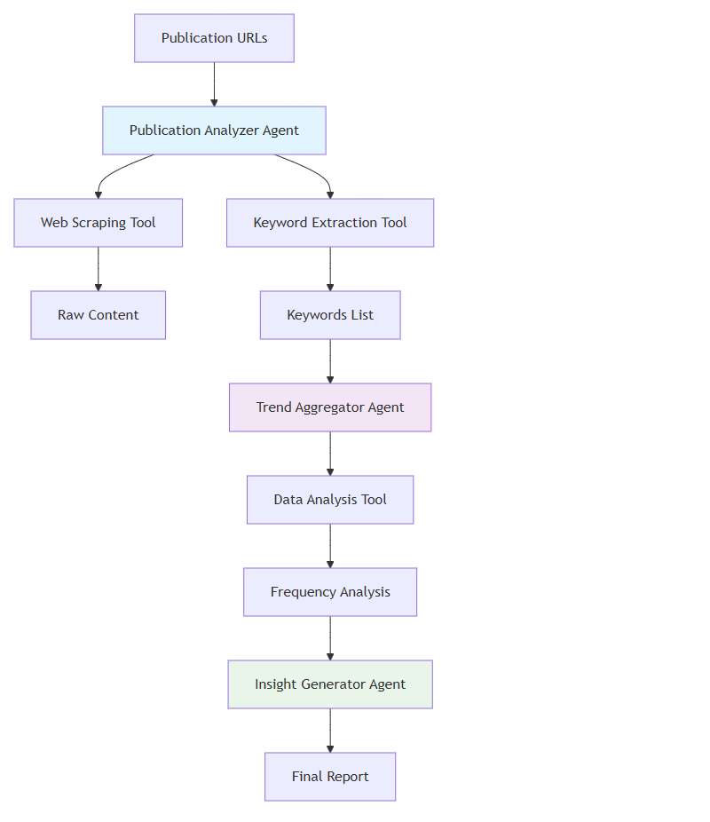

# Cross-Publication Insight Assistant

A multi-agent system that automatically analyzes collections of AI/ML publications to identify trends, patterns, and emerging technologies. The system processes publication URLs and generates comprehensive insights about technological trends and research directions across multiple sources.

## 🎯 Project Overview

This system demonstrates advanced multi-agent collaboration featuring:
- **3 Specialized AI Agents** working collaboratively
- **3+ Integrated Tools** for comprehensive content analysis
- **Sequential Pipeline Orchestration** for workflow management
- **Intelligent Web Scraping** with targeted content extraction

## 🏗️ System Architecture

### Agents

1. **Publication Analyzer Agent**
   - Role: Content Extraction Specialist
   - Scrapes publication content using targeted CSS selectors
   - Extracts keywords from publication text using NLP techniques

2. **Trend Aggregator Agent**
   - Role: Data Analysis Specialist
   - Aggregates keywords from multiple publications
   - Computes frequency statistics and identifies patterns

3. **Insight Generator Agent**
   - Role: Report Generation Specialist
   - Transforms quantitative data into human-readable insights
   - Ranks and presents the most significant trends

### Tools

1. **Web Scraping Tool** - Extracts content from publication URLs with CSS selector support
2. **Keyword Extraction Tool** - Uses NLTK for intelligent keyword extraction and filtering
3. **Data Analysis Tool** - Performs statistical analysis and frequency counting

## 🚀 Getting Started

### Prerequisites

- Python 3.8 or higher
- Required Python packages (see requirements.txt)

### Installation

1. **Clone the repository:**
   ```bash
   git clone https://github.com/AmmarAhmedl200961/cross-publication-insight-assistant.git
   cd cross-publication-insight-assistant
   ```

2. **Install dependencies:**
   ```bash
   pip install -r requirements.txt
   ```

### Usage

#### Basic Usage

```python
from src.main import main

# Run the analysis
main()
```

#### Command Line Usage

```bash
python -m src.main
```

## 📁 Project Structure

```
cross-publication-insight-assistant/
│
├── src/
│   ├── agents/
│   │   ├── __init__.py
│   │   ├── publication_analyzer.py
│   │   ├── trend_aggregator.py
│   │   └── insight_generator.py
│   │
│   ├── tools/
│   │   ├── __init__.py
│   │   ├── web_scraper.py
│   │   ├── keyword_extractor.py
│   │   └── data_analyzer.py
│   │
│   └── main.py
│
├── requirements.txt
└── README.md
```

## 🔧 Configuration

The system can be configured through environment variables and the `config.py` file:

- **OpenAI Model**: Configure which GPT model to use (default: gpt-4)
- **Temperature**: Control creativity vs. consistency (default: 0.7)
- **Max Tokens**: Set response length limits
- **Tool Timeouts**: Configure API timeout settings

## 📊 Example Output

```json
{
  "publication_analysis": {
    "analyzed_publications": 2,
    "total_keywords_extracted": 45,
    "processing_time": "12.3 seconds"
  },
  "trend_insights": {
    "top_keywords": [
      {"keyword": "multi-agent", "frequency": 8},
      {"keyword": "langgraph", "frequency": 6},
      {"keyword": "workflow", "frequency": 5},
      {"keyword": "collaboration", "frequency": 4},
      {"keyword": "orchestration", "frequency": 3}
    ]
  },
  "analysis_summary": "Analysis reveals strong emphasis on multi-agent systems and workflow orchestration technologies, with LangGraph emerging as a prominent framework for agent collaboration."
}
```

## 🧪 Testing

Run the test suite:

```bash
# Run all tests
python -m pytest tests/

# Run specific test categories
python -m pytest tests/test_agents.py
python -m pytest tests/test_tools.py
python -m pytest tests/test_integration.py

# Run with coverage
python -m pytest tests/ --cov=src --cov-report=html
```

## 🤝 Agent Communication Flow



The system follows a sequential pipeline where agents process data in a coordinated manner:

1. **Publication Analyzer** receives publication URLs and extracts content using targeted web scraping
2. **Trend Aggregator** processes extracted keywords from all publications to identify frequency patterns  
3. **Insight Generator** transforms aggregated data into human-readable trend reports
4. **Final Output** presents comprehensive analysis results to the user

## 🔍 Key Features

- **Targeted Content Extraction**: Uses CSS selectors to focus on relevant publication content
- **Intelligent Keyword Processing**: Leverages NLTK for sophisticated text analysis and filtering
- **Multi-Publication Analysis**: Aggregates insights across multiple sources for trend identification
- **Extensible Architecture**: Modular design supports easy addition of new agents and tools
- **Error Handling**: Robust error management for web scraping and content processing

## 📝 Best Practices Implemented

- **Modular Architecture**: Clean separation of concerns
- **Error Handling**: Comprehensive try-catch blocks and logging
- **Security**: Environment variables for sensitive data
- **Documentation**: Thorough code documentation and type hints
- **Testing**: Unit tests for all components
- **Version Control**: Clear Git history with meaningful commits

## 🚧 Future Enhancements

- [ ] Integration with academic databases (arXiv, Google Scholar)
- [ ] Real-time trend monitoring with temporal analysis
- [ ] Advanced semantic analysis beyond keyword frequency
- [ ] Interactive visualization of trend data
- [ ] Support for additional publication formats (PDF, DOC)
- [ ] Machine learning models for trend prediction

## 🤝 Contributing

1. Fork the repository
2. Create a feature branch (`git checkout -b feature/amazing-feature`)
3. Commit your changes (`git commit -m 'Add amazing feature'`)
4. Push to the branch (`git push origin feature/amazing-feature`)
5. Open a Pull Request

## 📄 License

This project is licensed under the MIT License - see the [LICENSE](LICENSE) file for details.

## 🙏 Acknowledgments

- LangGraph framework for multi-agent orchestration concepts
- NLTK library for natural language processing capabilities
- BeautifulSoup and Requests libraries for web scraping functionality
- The open-source community for inspiration and tools

## 📞 Support

For questions or support:
- Create an issue on GitHub
- Check the documentation and code comments
- Review the publication analysis examples

---

**Built with ❤️ using Multi-Agent System Principles**
